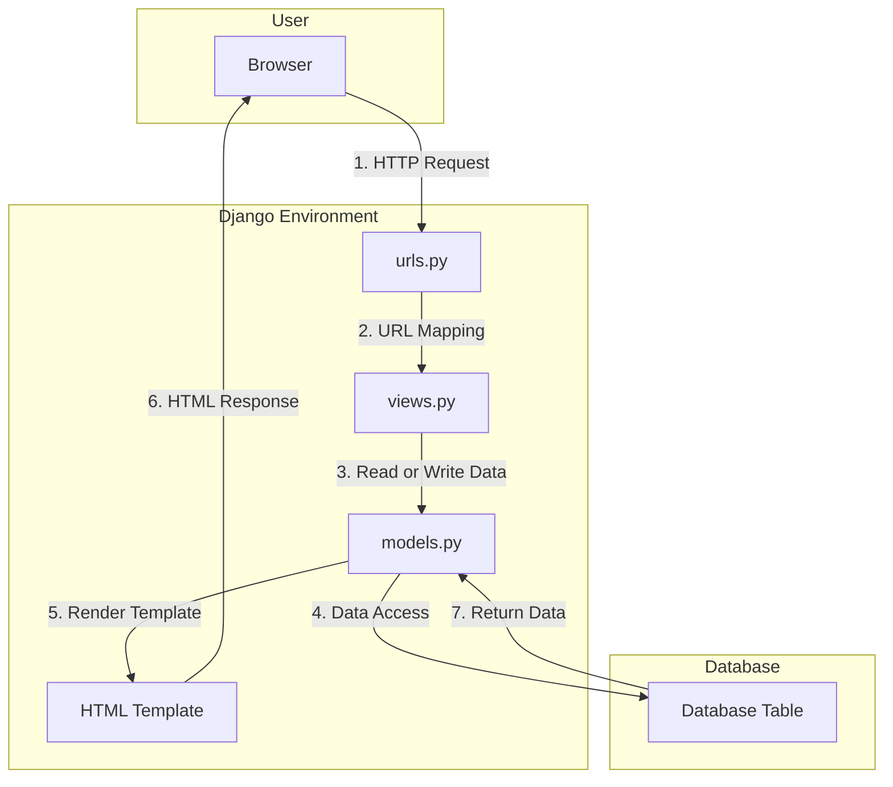

# 📝Inventory List📝

**Student Details :**

|  `Attribute`  |               `Information`               |
|---------------|-------------------------------------------|
| Name          | Ardhika Satria Narendra                   |
| Student ID    | 2206821866                                |
| Class         | PBP KKI                                   |
| Website URL   | https://inventorylist.adaptable.app/main/ |

---
<details>
<summary>Assignment 2: Model-View-Template (MVT) Implementation on Django</summary>

## Questions and Answers

### -> How do you implement the tasks in the checklist?

1. **Creating a new Django project**

   To start building this application, I initiated a new Django project. Here's how I did it:
   
  - Opened the terminal or command prompt on my system.
  - Navigated to the directory where I wanted to store my Git projects using the command `cd <directory_name>`.
  - Initialized a new repository with the command `git init`. This command created an empty Git repository in my chosen directory.
  - Create and activate the virtual environment by running the following command `python -m venv env` and `env\Scripts\activate.bat`.
  - Created a file named requirements.txt and installed the dependencies with the following command `pip install -r requirements.txt`.
  - Create a Django project using this command `django-admin startproject inventory_list`.
  - Add "*" on `ALLOWED_HOST` in `settings.py`
```
ALLOWED_HOST = ["*"]
```
- Add `.gitignore` file
2. **Creating an app with the name main on that project**

    I needed to create a new app within my Django project. Here's the process I followed:
  - Ran the following command: `python manage.py startapp main`. This command created a new app named "main" within my project.
  - Add `'main'` to the list of existing applications in settings.py.
  - Create folder `templates` inside `main` also `main.html` inside the folder.

3. **Creating a URL routing configuration to access the 'main' app**

   To ensure that I could access the 'main' app, I set up URL routing. Here's how I configured it:
  - Opened the main project's `urls.py` file located in the project's root directory.
  - Imported the `include` function from `django.urls`: `from django.urls import path, include`.
  - Added a new URL pattern to include the 'main' app's URLs. For example:
    ```
    path('main/', include('main.urls')),
    ```
    This mapping directed the `/main/` URL path to the URLs defined in the `main` app's `urls.py`.

4. **Creating a model within the 'main' app**

   I needed to define a model within the 'main' app with specific attributes. Here's how I implemented it:
  - In the `main` app directory, I opened the `models.py` and modified it with the mandatory attributes.
  - In this step, I created a model named `Item` within the 'main' app. The model will define the attributes of items in my inventory management application.

5. **Creating a function in 'views.py' to return an HTML template**
   
     To display information about the application, app name, my name, and my class, I created a view function. Here's how I accomplished it:
  - In the `main` app directory, I opened the `views.py` file.
  - I defined a view function, for example, `show_main`, that took a `request` parameter.
  - Within the view function, I created a `context` dictionary with the necessary data, including app name, my name, and class.
  - I used the `render` function to render an HTML template (e.g., `main.html`) and passed the `context` data to it.

6. **Creating a URL routing to map the function in 'views.py'**

   To ensure that the view function I created is accessible through a URL, I configured URL routing within the 'main' app. Here's how I did it:
- In the `main` app directory, I created a `urls.py` file.
- I defined URL patterns within the `urls.py` file, for example:
     ```
     from django.urls import path
     from main.views import show_main

     app_name = 'main'

      urlpatterns = [
         path('', show_main, name='show_main'),
      ]
      ```
      This mapping directed the root URL (e.g., `/main/`) to the `show_main` view function.
     
7. **Deploying the app to Adaptable**
   
   To make the application accessible online, I deployed it to Adaptable or a similar hosting service. Here are the general steps I followed:
- I ensured that my Django project was under version control with Git.
- I pushed my project code to the GitHub repository.
- I used Adaptable or a similar service to deploy my Django application, following my lecture's deployment instructions to make the app accessible online.
  
---
### -> Create a diagram explaining the flow of client requests to a Django web app and its response


Here's a step-by-step explanation of the depicted process:

1. **HTTP Request**: The user makes a request via a web browser.
    - **Component**: Browser
    - **Action**: The browser sends an HTTP request to the Django environment.

2. **URL Mapping**: The request reaches the `urls.py` in the Django environment.
    - **Component**: urls.py
    - **Action**: Django uses the `urls.py` file to map the incoming request to the corresponding view.

3. **Read or Write Data**: The view (`views.py`) may need to read or write data to the database using Django models.
    - **Component**: views.py & models.py
    - **Action**: Depending on the nature of the request (e.g., GET, POST), the view might fetch or update data from the database using models.

4. **Data Access**: The views might also need to access certain HTML templates to generate a response.
    - **Component**: views.py & HTML Template
    - **Action**: The view fetches the relevant HTML template if needed.

5. **Render Template**: The models help in fetching the necessary data which is then used to populate and render the HTML templates.
    - **Component**: models.py & HTML Template
    - **Action**: The actual data is filled into the template to create a meaningful HTML page for the user.

6. **HTML Response**: The populated HTML template is then sent back as a response to the browser.
    - **Component**: HTML Template & Browser
    - **Action**: The rendered HTML page is displayed on the user's browser.

7. **Access**: This is a separate process where models interact with the database tables to perform CRUD operations.
    - **Component**: models.py & Database Table
    - **Action**: Direct interaction with the database to either create, read, update, or delete records.

To sum it up, when a user sends a request from their browser, Django processes it by mapping the request to a view, accessing the necessary data and templates, and then sending back the relevant HTML response. The database plays a central role, storing and providing data when needed.

---

### -> What is the purpose of a virtual environment? Can we create a Django web app without a virtual environment?
A virtual environment is a self-contained directory tree that contains a Python installation for a particular version of Python, along with a number of additional packages. The primary purpose of a virtual environment is to:
1. Isolation: Virtual environments allow Python projects to have isolated dependencies, ensuring that the requirements of each project are in harmony with those of others.
2. Dependency Management: To minimise issues, virtual environments manage different library versions across projects.
3. Version Control: Virtual environments make it easier to work with and test different Python versions.
4. Clean Environment: When starting a new project, we can create a new virtual environment to ensure we're working in a clean environment with only the necessary dependencies installed.

Yes, we can create a Django web app without a virtual environment. However, there are some downsides to this:
1. Potential Dependency Conflicts: Without using a virtual environment, it will risk running into issues where Django or one of its dependencies conflicts with another library or application on our system.
2. System Pollution: Installing everything globally can clutter the system's Python environment with unnecessary packages.
3. Versioning Issues: If we're working on two Django projects where one uses Django 2.x and the other uses Django 3.x, we'll face issues if we don't use separate virtual environments.
4. Deployment Challenges: It becomes more challenging to ensure that our production environment matches our development environment in terms of dependencies and versions, which can lead to unexpected behaviours and bugs.

Using virtual environments is a best practice in Python development, especially with web frameworks like Django, because of the challenges and risks mentioned above. While it's not strictly required, it's highly recommended.

---

### -> What is MVC, MVT, and MVVM? Explain the differences between the three.

**MVC (Model-View-Controller):**
- **Model**: Manages the data and business logic.
- **View**: Displays the data (the UI part).
- **Controller**: Handles the user's input and updates the Model and View.

**MVT (Model-View-Template):**
- **Model**: Represents the data structure.
- **View**: Controls what data is displayed and how (more like a controller).
- **Template**: How the data is displayed (akin to the view in MVC).

**MVVM (Model-View-ViewModel):**
- **Model**: Represents the data.
- **View**: Displays the data, purely the UI.
- **ViewModel**: An abstraction of the view, that holds presentational logic.

**Differences:** 
1. **MVC**: A discrete separation in which the controller serves as a connection between the Model and the View.
2. **MVT**: This is primarily used in Django. The "View" works more like a controller, whereas the "Template" is similar to the MVC view.
3. **MVVM**: Suitable for applications with an abundant user interface, such as those built using WPF or Angular. It connects the View and ViewModel, allowing them to communicate with one another.

While all three are architectural patterns aimed at separating concerns, they differ in how they divide jobs and duties.

</details>

---

<details>
<summary>Assignment 3: Forms and Data Delivery Implementation in Django</summary>

## Questions and Answers

### -> What is the difference between `POST` form and `GET` form in Django?
Let's compare POST and GET forms in Django. There are various significant dissimilarity listed below, which I will explain one by one in each category :
   1. **Data Transmission Method**: 
      - GET: Sends data via the URL. When a GET form is submitted, the form data is attached to the URL as query parameters.
      - POST: Sends data in the HTTP request body rather than the URL. It is more suited for transmitting big amounts of data or sensitive information.
   2. **Visibility**: 
      - GET: Because the data is in the URL, anyone who sees the URL can view it. A poor choice for private information.
      - POST: Because the data is in the request body, it is hidden from viewers.
   3. **Usage**: 
      - GET: Typically used for obtaining or retrieving data where the action does not change or influence the data on the server. For example, searching or filtering results.
      - POST: Used for activities that modify data or have side effects, such as submitting a form to register an account or placing an order.
   4. **Data Limits**: 
      - GET: Limited by the URL length, which is normally around 2,000 characters, however this limit may differ by browser and server.
      - POST: Can handle a significantly higher quantity of data because it is in the request body.
   5. **Idempotency (a bit technical, but useful to know)**:
      - GET: Considered independent, which means that making the same request numerous times should produce the same response without producing any side effects.
      - POST: Not idempotent. Submitting a POST request several times may result in the creation of multiple resources or the triggering of various actions.

---

### -> What are the main differences between XML, JSON, and HTML in the context of data delivery?
I will explain the distinction using a simple illustration to make it clear :
   1. **Extensible Markup Language (XML)**:
      Consider XML to be a nice gift box with each thing carefully labelled. You've assigned tags to each item of data.         It's the same as wrapping a toy and labelling it: <toy>Train set</toy>. It's thorough, but with all many labels, it       can feel a little heavy. XML can be used for organised and self-descriptive data.

   2. **JSON (JavaScript Object Notation)**:
      JSON is similar to those reusable gift bags. It's more sleek and manageable than the box. Instead of utilising            elaborate labels like XML, JSON employs a basic key-value pair system, similar to tagging a gift with "toy": "Train       set." It's grown highly popular due to its light weight and ease of reading. JSON is preferred for simple data            transfer and JavaScript interaction.

   3. **HTML  (Hypertext Markup Language)**:
      HTML, on the other hand, is a little different. Consider it a gift wrapped to display and show off bits of what's         inside, similar to clear gift bags or wrappers. It is not only about the data, but also about how it appears and is       presented. It's intended to be seen in web browsers, displaying content in an aesthetically organised manner. HTML        is concerned with presenting data in a visual format, with an emphasis on its appearance and layout.
      
---

### -> Why is JSON often used in data exchange between modern web applications?
JSON is simple to produce and understand because it uses a human-readable format of key-value pairs and arrays. Unlike XML, another popular data format for online applications, JSON does not require any particular tags, attributes, or schemas. Because of its quick data transfer and web service processing results, human-readable text/code, lightweight nature, and fewer coding requirements, JSON is frequently utilised in data exchange across modern web applications. JSON is text-based, making it user friendly for developers. It also provides an easy-to-parse data format, implying less code is required for interpreting. Moreover, JSON supports better database schema and is highly interoperable/compatible with applications/technologies including the WebSocket, GraphSQL, and RESTful (Representational State Transfer) website services.

---

### -> Explain how you implemented the checklist above step-by-step (not just following the tutorial).
1. **Create a new file inside the `main` folder named `forms.py`**

   I created a new file inside the `main` folder named `forms.py` to creating a form that interfaces with my database models, specifically to add, edit, or display products.
   
   ```
   from django.forms import ModelForm
   from main.models import Product

   class ProductForm(ModelForm):
       class Meta:
           model = Product
           fields = ["name", "price", "description"]
      ```

2. **Create a base template**

   In this step, I created a folder named `templates` in the **root directory**. Inside the `templates` folder, I also created a file named `base.html`. This file will serve as a base template, providing a general structure for my website's pages.

   ```
   
   <!DOCTYPE html>
   <html lang="en">
       <head>
           <meta charset="UTF-8" />
           <meta
               name="viewport"
               content="width=device-width, initial-scale=1.0"
           />
           
           
       </head>

       <body>
           
           
       </body>
   </html>
   
   ```
   
3. **Updating `views.py`**
   
   At this stage, I incorporated certain imports and devised a new function named `create_product` that takes a `request` parameter. Concurrently, I adjusted the `show_main` function within `views.py`.

   During this phase, I enhanced the `views.py` to support product creation and introduced the capability to retrieve data in both XML and JSON formats. I also added functionality to obtain data based on the product ID in both XML and JSON formats.
   
   ```
   from django.shortcuts import render
   from django.http import HttpResponseRedirect
   from django.urls import reverse
   from main.forms import ProductForm
   from main.models import Product
   from django.http import HttpResponse
   from django.core import serializers

   def show_main(request):
       products = Product.objects.all()

       counter = products.count()

       context = {
           'app_name':'Inventory List',
           'name': 'Ardhika Satria Narendra',
           'class': 'PBP KKI',
           'products': products,
           'counter' : counter,
       }

       return render(request, 'main.html', context)

   def create_product(request):
       form = ProductForm(request.POST or None)

       if form.is_valid() and request.method == "POST":
           form.save()
           return HttpResponseRedirect(reverse('main:show_main'))

       context = {'form': form}
       return render(request, "create_product.html", context)

   def show_xml(request):
       data = Product.objects.all()
       return HttpResponse(serializers.serialize("xml", data), content_type="application/xml")

   def show_json(request):
       data = Product.objects.all()
       return HttpResponse(serializers.serialize("json", data), content_type="application/json")

   def show_xml_by_id(request, id):
       data = Product.objects.filter(pk=id)
       return HttpResponse(serializers.serialize("xml", data), content_type="application/xml")

   def show_json_by_id(request, id):
       data = Product.objects.filter(pk=id)
       return HttpResponse(serializers.serialize("json", data), content_type="application/json")
   ```

4. **Add new routings to `urls.py`**
   
   I imported the previously created `create_product` function. `from main.views import show_main, create_product` and also add a new url path inside the `urlpatterns` list to access the previously imported function.
   
   ```
   # main/urls.py
   
   # ...
   
   urlpatterns = [
       path('', show_main, name='show_main'),
       path('create-product', create_product, name='create_product'),
       path('xml/', show_xml, name='show_xml'),
       path('json/', show_json, name='show_json'),
       path('xml/<int:id>/', show_xml_by_id, name='show_xml_by_id'),
       path('json/<int:id>/', show_json_by_id, name='show_json_by_id'),
   ```

5. **Creating a new HTML file named `create_product.html`**

   At this point, I navigated to the templates subdirectory inside the main folder and crafted a new HTML file named `create_product.html`. This code is used for creating a web form to add new products  and submit them to the database.
   
   ```
    

   
   <h1>Add New Product</h1>

   <form method="POST">
       
       <table>
           {{ form.as_table }}
           <tr>
               <td></td>
               <td>
                   <input type="submit" value="Add Product"/>
               </td>
           </tr>
       </table>
   </form>

   
   ```
   
6.  **Updating `main.html`**

      I added this code between `` and `` to display product data in a table format and included a button to redirect users to the form page.
    
      ```
      ...
      <table>
          <tr>
              <th>Name</th>
              <th>Price</th>
              <th>Description</th>
              <th>Date Added</th>
          </tr>

           Below is how to show the product data 

          
              <tr>
                  <td>{{product.name}}</td>
                  <td>{{product.price}}</td>
                  <td>{{product.description}}</td>
                  <td>{{product.date_added}}</td>
              </tr>
          
      </table>

      <br />

      <a href="">
          <button>
              Add New Product
          </button>
      </a>

      
      ```

---

### -> Access the five URLs in point 2 using Postman, take screenshots of the results in Postman, and add them to `README.md`.
1. **http://localhost:8000/**

   

2. **http://localhost:8000/xml**

    

3. **http://localhost:8000/json**

   


4. **http://localhost:8000/xml/2**
   
   

5. **http://localhost:8000/json/2**

   

</details>

---

<details>
<summary>Assignment 4: Implementing Authentication, Sessions, and Cookies in Django</summary>

## Questions and Answers

### -> What is `UserCreationForm` in Django? Explain its advantages and disadvantages.
`UserCreationForm` is a built-in form that eases us to create a user registration form. With this form, we can create a registration form without needing to code it from scratch. The `UserCreationForm` in Django is a model form class, provided by Django’s authentication framework, which is specifically designed to manage the user creation process. Django is a high-level Python Web framework that encourages rapid development and clean, pragmatic design.

**`UserCreationForm` Overview**:
`UserCreationForm` is used to create new user instances. It comes pre-built with fields for the username, password1 (password), and password2 (password confirmation). When used in combination with Django’s authentication views and templates, it provides an out-of-the-box solution for user registration.

**Advantages of `UserCreationForm`**:
   1. **Simplicity and Time Efficiency**:
      - It is straightforward and easy to use. 
      - It helps in creating user registration forms quickly as it includes the essential fields required for user   creation.
      - Saves time as developers do not have to create a registration form from scratch.

   2. **Security**:
      - Manages password hashing and salting, ensuring password security.
      - It includes built-in validation for password confirmation and can include custom password validation rules.

   3. **Customizability and Extensibility**:
      - Can be extended to include additional fields if the default fields are not sufficient for the application’s needs.
      - Can be customized to alter its default behavior and appearance.
        
   4. **Integration**:
      - Easily integrates with Django’s built-in User model and authentication system.
      - Can be readily used with Django’s class-based views, like CreateView, to quickly create registration views.
        
**Disadvantages of `UserCreationForm`**:
   1. **Limited Fields**:
      - It comes with a very limited set of fields – username, password1, and password2. If more information needs to be collected during user registration, developers will have to extend this form or create a custom form.

   2. **Styling and Customization**:
      - The default form may not meet the styling or structural requirements of all projects, necessitating additional customization which may not be straightforward for beginners.

   3. **Overhead**:
      - For extremely simple or unconventional projects, the built-in form and the accompanying processes might seem to have unnecessary overhead.
      - If the project requires a highly custom user creation process, developers might opt to create their own user creation forms and views.

---

### -> What is the difference between authentication and authorization in Django application? Why are both important?
Authentication and Authorization are crucial security mechanisms, and though they are related, they serve different purposes. Here’s a detailed breakdown of what they mean and why they are essential, especially in a Django application:

**Authentication**:
- **Definition**: Authentication is the process of verifying the identity of a user, system, or application. It ensures that a user is who they claim to be.
- **In Django**: Django’s built-in authentication system handles user authentication. It provides forms and views to handle user login, logout, password reset, etc.
- **Importance**: Without authentication, there is no way to ensure that users are who they say they are, leading to significant security risks. It is the fundamental step before authorization and is crucial to protect user data and restrict access.
  
**Authorization**:
- **Definition**: Authorization is the process of verifying what a user, system, or application is allowed to do after they are authenticated. It determines the permissions an authenticated user has within the application.
- **In Django**: Django provides a built-in permission system to handle user authorization. It allows defining permissions at the model level and associating them with user instances. Django also supports creating custom permissions to implement complex authorization rules.
- **Importance**: Authorization is crucial to protect sensitive operations and data within the application. It ensures that users can only perform actions and access data they are allowed to, preventing unauthorized access and modifications.

**Why are Both Important in a Django Application?**

   1. **Security**:
      - Together, authentication and authorization provide a layer of security that protects user data and resources from unauthorized access and potential malicious activities.
      - They ensure that only authenticated and authorized users can access certain parts of the application, preventing security breaches.

   2. **User Management**:
      - They allow developers to implement user management within applications, giving different access levels to different users, such as regular users, staff users, and superusers.
   - This is essential for creating multi-user applications with different roles and responsibilities, such as admin panels.
     
   3. **Data Integrity**:
      - They help maintain data integrity by preventing unauthorized modifications or deletions of data.
      - By controlling who has access to modify data, they help in maintaining the reliability and accuracy of the application data.
        
   4. **Compliance**:
      - Many applications need to comply with various regulatory standards that require strict authentication and authorization mechanisms to protect user data.
      - Implementing proper mechanisms is crucial for legal compliance and protecting user privacy.
        
   5. **User Trust**:
      - Implementing robust authentication and authorization processes can help in building trust with the users as they can be assured that their data is secure and can only be accessed or modified by authorized entities.

---

### -> What are cookies in website? How does Django use cookies to manage user session data?
**Cookies in Websites**:
Cookies are small pieces of data stored on the client-side, which the web server sends to the user's web browser. The browser may then store the cookie and send the cookie information back to the server with every subsequent request to the same server. Typically, it's used to tell if two requests come from the same browser, like storing and managing user preferences, tracking users, and enabling session management on websites.

**Django and Cookies for Session Management**:
Django can use cookies to manage user session data, allowing for persistent sessions across requests. In Django, when a user logs in, the server creates a unique session ID and sends it to the client as a cookie. When the client sends a subsequent request, it includes the session ID cookie, allowing the server to retrieve the corresponding session data stored on the server-side.

---

### -> Are `cookies` secure to use? Is there potential risk to be aware of?
Yes, cookies can be secure to use when proper security measures are applied, but there are potential risks to be aware of.

**Risks**:
   1. **Session Hijacking**: Cookies can be stolen, enabling unauthorized users to impersonate the legitimate user.
   2. **Cross-Site Scripting (XSS)**: Cookies can be accessed through malicious scripts.
   3. **Cross-Site Request Forgery (CSRF)**: Attackers can force users to perform actions unknowingly.
   4. **Man-In-The-Middle Attacks**: Cookies can be intercepted over insecure connections.
   5. **Third-Party Tracking**: Privacy concerns due to tracking users across different sites.
   6. **Data Integrity**: Tampering risk if cookies are not properly signed and encrypted.
   
**Mitigations**:
   1. **Use HttpOnly Attribute**: To protect cookies from being accessed by client-side scripts.
   2. **Use Secure Attribute**: To ensure cookies are sent only over HTTPS.
   3. **Implement SameSite Attribute**: To protect against CSRF attacks.
   4. **Obtain User Consent**: For setting cookies and inform them about cookie policies.
   5. **Do Not Store Sensitive Data**: Store sensitive data server-side and use cookies only for storing session IDs or non-sensitive data.
   6. **Sign and Encrypt Cookies**: To ensure data integrity and confidentiality.

---

### -> Explain how you implemented the *checklist* above step-by-step (not just following the tutorial).

1. **Developing Registration Form and Functionality**
   - Initiate the virtual environment and open the `views.py` file. Subsequently, incorporate the imports for `redirect`,    `UserCreationForm`, and `messages` at the commencement of the file.
   ```
     from django.shortcuts import redirect
     from django.contrib.auth.forms import UserCreationForm
     from django.contrib import messages
     ```
   - Create a `register` function in `views.py`
     ```
     def register(request):
     form = UserCreationForm()

       if request.method == "POST":
           form = UserCreationForm(request.POST)
           if form.is_valid():
               form.save()
               messages.success(request, 'Your account has been successfully created!')
               return redirect('main:login')
       context = {'form':form}
       return render(request, 'register.html', context)
      ```
   - Construct a new HTML file and name it `register.html`, placing it within the main/templates directory.
     
      ```
        

         
             <title>Register</title>
         

           

         <div class = "login">
    
             <h1>Register</h1>  

                 <form method="POST" >  
                       
                     <table>  
                         {{ form.as_table }}  
                         <tr>  
                             <td></td>
                             <td><input type="submit" name="submit" value="Daftar"/></td>  
                         </tr>  
                     </table>  
                 </form>

                 
                 <ul>   
                       
                         <li>{{ message }}</li>  
                           
                 </ul>   
             

         </div>  

         

         ```

2. **Developing a Login Function, Incorporating Last Login Date to Cookies, and Displaying Last Login on the Main Page**
   
      - Within `views.py`, integrate `authenticate` and `login`. Subsequently, formulate a `login_user` function that retrieves the last login date and incorporates it into the cookie, as demonstrated in the following code:
      ```
      from django.contrib.auth import authenticate, login
      ```

      ```
      def login_user(request):
          if request.method == 'POST':
           username = request.POST.get('username')
           password = request.POST.get('password')
           user = authenticate(request, username=username, password=password)
           if user is not None:
               login(request, user)
               response = HttpResponseRedirect(reverse("main:show_main")) 
               response.set_cookie('last_login', str(datetime.datetime.now()))
               return response
           else:
               messages.info(request, 'Sorry, incorrect username or password. Please try again.')
         context = {}
       return render(request, 'login.html', context)
      ```

      - Construct a new HTML file, naming it `login.html`, and position it inside the main/templates directory.
     
      ```
      

      
          <title>Login</title>
      

      

      <div class = "login">

          <h1>Login</h1>

          <form method="POST" action="">
              
              <table>
                  <tr>
                      <td>Username: </td>
                      <td><input type="text" name="username" placeholder="Username" class="form-control"></td>
                  </tr>
                    
                  <tr>
                      <td>Password: </td>
                      <td><input type="password" name="password" placeholder="Password" class="form-control"></td>
                  </tr>

                  <tr>
                       <td></td>
                      <td><input class="btn login_btn" type="submit" value="Login"></td>
                  </tr>
              </table>
          </form>

          
              <ul>
                  
                      <li>{{ message }}</li>
                  
              </ul>
               
        
          Don't have an account yet? <a href="">Register Now</a>

      </div>

      

      ```

   - Modify `views.py` and incorporate the logout_user function as illustrated below:
     
     ```
      def logout_user(request):
          logout(request)
          response = HttpResponseRedirect(reverse('main:login'))
          response.delete_cookie('last_login')
          return response
     ```
     
    Establish the routing for this function in `urls.py`. Integrate a `logout` button in `main.html` to facilitate user logout.

3. **Implementing Access Restrictions to the Main Page for Unauthenticated Users**
      
     Within `views.py`, incorporate `login_required` and then place `@login_required(login_url='/login')` above the `show_main` function to enforce login restrictions.

4. **Refining the create_product Function**
      
     ```
      def create_product(request):
      form = ProductForm(request.POST or None)

      if form.is_valid() and request.method == "POST":
          product = form.save(commit=False)
          product.user = request.user
          product.save()
          return HttpResponseRedirect(reverse('main:show_main'))
   
     ```

     The `create_product` function in Django initializes a `ProductForm`, either with the submitted POST data if available or as an unpopulated form if no data is present. Upon the form's submission and subsequent validation, the function employs `form.save(commit=False)`, allowing for alterations to the product object prior to its database storage. It specifically assigns the currently authenticated user to the product’s user attribute, linking the product to the appropriate user. Post the assignment of the user attribute, the product object undergoes storage in the database through `product.save()`. Subsequently, the user experiences a redirection to the 'main:show_main' URL pattern, signaling the successful product creation.

   - Modify the `show-main` function :
   ```
   def show_main(request):
       products = Product.objects.filter(user=request.user)

       context = {
           'name': request.user.username,
       ...
   ...

   ```

5. **Account and Dummy Data Creation**
   
   Establish two user accounts and generate three dummy data entries for each account, utilizing the previously defined model.

</details>

---

<details>
<summary>Assignment 5: Web Design using HTML, CSS, and CSS Framework</summary>

## Questions and Answers

### -> Explain the purpose of some CSS element selector and when to use it.

1. The CSS element selector is a sort of selector that targets HTML elements based on their tag name. It enables you to apply styles to all instances of a specified HTML element in your document. The CSS element selector is like to pointing to a category of goods at a store and saying, "I want all goods of this category to look this way." For instance, if you're in a shop and decide that all hardcover books should have blue stickers, "hardcover books" would be the equivalent of the "element" in CSS.

   Purpose:
1. Uniformity: By using the element selector, all elements of the same type will have the same appearance. This ensures that the design of your website is consistent.
2. Simplicity: Instead of adding a class or an ID to each and every element you want to style, simply use the element's name, making your HTML clearer.
3. Baseline Styles: Using default styles for elements (such as the default font for all paragraphs) to set the tone for further styles is a frequent practise

   How to use it: 

   Imagine you have an HTML document, and you want to style all the paragraphs (`<p>`) and headings (`<h1>`).

   HTML:
   ```html
   <h1>Welcome to My Website</h1>
   <p>This is a paragraph about my website.</p>
   <h1>Another Heading</h1>
   <p>Here is another paragraph with more details.</p>
   ```

   CSS:
   To make all the `<h1>` elements have a red color and all the `<p>` elements have a blue color, you'd use the CSS element selector like this:

   ```css
   h1 {
       color: red;
   }

   p {
       color: blue;
   }
   ```

   In this example:

   - `h1` is the element selector for all `<h1>` elements.
   - `p` is the element selector for all `<p>` elements.

   Whenever the browser sees these selectors in the CSS, it says, "Alright, every `<h1>` tag should be red, and every `<p>` tag should be blue."

   A Quick Tip:

   Remember that styles set using element selectors are the baseline and can be overridden by more specific selectors (like class or ID selectors). So if you have a particular `<p>` that you want in green, you'd give it a class (e.g., `<p class="special">`) and then define that class in your CSS to override the blue color.

---

### -> Explain some of the HTML5 tags that you know.

Imagine you have an old phone model, then one day a newer model with cooler features and greater performance is released. Similarly, HTML5 is the most recent version of HTML (as of my previous update). It's similar to an upgrade that includes new capabilities and improved compatibility for modern web features.

I'll explain HTML5 tags in a very approachable way.

`<header>`
Think about a favourite magazine. You're aware that the magazine's name and perhaps this month's primary feature are at the top? That resembles the "header" tag. The title, logo, and major navigation of a website are often found in the first part of the page.

`<footer>`
Flip that magazine now all the way to the end. The page numbers, publication information, and possibly a few brief disclaimers will all be visible. Your "footer" on the web is that. The area at the bottom of your page is a handy place for credits, links, and other information.

`<nav>`
Do you recall those directories from the malls? the ones that outline the locations of each store? That resembles the "nav" bar. It's designed specifically for important navigation links to make it easier for users to navigate your website.

`<article>`
Let's get back to our magazine. An "article" is any story, feature, or interview that can be taken in isolation and comprehended. A blog post, news article, or any other self-contained piece of material would then be included in a "article" tag on a website.

`<section>`
Consider a book chapter. Each chapter has an own topic, correct? The "<section>" element is used on web pages to arrange related material under a theme. 

`<figure>` and `<figcaption>`
Have you ever seen those expensive coffee table books with large photos and short captions? The "figcaption" tag is that tiny caption, while the "<figure>" tag is like that image. Together, they present content (often an image) and a caption that go along with it.

Example:

```
html
<figure>
    
    <figcaption>Meet Fluffy, the cutest dog in town.</figcaption>
</figure>
```

`<aside>`
Think of those little boxes or side notes in textbooks that give extra, but non-essential information. That's what <aside> does on a webpage. It holds content related to the main content but can be read separately, like a sidebar with fun facts.

`<canvas>`
Do you have any memories of drawing on white paper as as a kid? Similar to that blank sheet, but digital, is "canvas." It doesn't accomplish much by itself, but with a little help from JavaScript, it can transform into a place for images, animations, or even games.

---

### -> What are the differences between margin and padding?

I'll explain it by comparing it to a gift package.

Padding: The padding is the area between the gift and the box's inside walls. It is the area *within* the element's border, between the element's content and its border.

Margin:
This box is now placed within a gift bag. The margin is similar to the space between the box and the gift bag's interior walls. It is the area *outside* the element's border, between the element's border and elements around it.

So in simpler terms:
- Padding is the space *inside* the box, giving cushion to the content.
- Margin is the space *outside* the box, separating it from other boxes.

---

### -> What are the differences between the CSS framework Tailwind and Bootstrap? When should we use Bootstrap rather than Tailwind, and vice versa?

With Bootstrap, you may get ready-made elements with a specified appearance, such as buttons and navbars. Although they are pre-styled, you can customise them. On the other hand, Taliwind Offers low-level utility classes that help you create original designs from beginning. You create your own parts by fusing these tools rather than using premade ones. Although both Bootstrap and Tailwind CSS are well-liked front-end frameworks and technologies, their functions and methods of web creation differ. A comparison is provided below, along with advice on when you might prefer to utilise one over the other:

Bootstrap:

1. Component Library: Bootstrap comes with a collection of pre-made components, like navbars, modals, carousels, and others. Bootstrap could be a nice option if you require these right out of the box.
2. Theming: Bootstrap is designed with a theming system that allows you to simply change the appearance of the entire framework by modifying a few Sass variables.
3. Opinionated Design: Bootstrap has default design choices that make it easier to start a project quickly. If not customised, this could result in a lot of websites having a similar appearance.
4. JavaScript Plugins: To provide some components more functionality, Bootstrap includes a number of jQuery plugins. Bootstrap is useful if you currently use jQuery and want these capabilities.4. JavaScript Plugins: Bootstrap includes several jQuery plugins to provide additional functionality to some components. If you're already using jQuery and want these features, Bootstrap is beneficial.

Use Bootstrap When:
- MVP or rapid prototyping.
- When a large component library is required.
- When you don't want to deal with component-by-component design decisions.

CSS Tailwind

1. Utility-first: Tailwind offers low-level utility classes rather than pre-styled components. This method enables quick development without having to leave your HTML, but it also could require you to create extra class names.
2. Tailwind's level of customization is high. The spacing, colours, and other aspects of the design system can all be changed by modifying the configuration file.
3. Less Opinionated Design: Tailwind does not impose a specific aesthetic. It offers resources for designing, which might result in websites with more distinctive looks.
4. Tailwind just uses CSS; it does not need JavaScript. You must incorporate JavaScript libraries or create your own scripts if you want interactive components.
5. Smaller Bundles: You can reduce file sizes by removing unnecessary CSS with the help of programmes like PurgeCSS (which is now included in Tailwind by default).

When to Use Tailwind CSS: - Projects where you desire a distinctive design or additional design flexibility.
- When you prefer to work with HTML and take a utility-first approach.
- If you want to make sure the final build has the bare minimum of unnecessary CSS.
- JavaScript applications employing React, Vue, or Angular, among other contemporary frameworks.

In the end, it comes down to individual prefrence and the particular requirements of the project. Choose Bootstrap if you want pre-made elements and design. Choose Tailwind CSS if you prefer greater customizability, flexibility, and a utility-first philosophy. In any case, both programmes are widely used, have sizable communities, and rich documentation

---

### -> Explain how you implemented the checklist above step-by-step (not just following the tutorial).

1. **Adding bootstrap framework**

2. **Modify Templates**
   
   - base.html
  
```

<!DOCTYPE html>
<html lang="en">

<head>
    
    <meta charset="UTF-8" />
    <meta name="viewport" content="width=device-width, initial-scale=1">
    
    <link href="https://cdn.jsdelivr.net/npm/bootstrap@5.3.2/dist/css/bootstrap.min.css" rel="stylesheet"
        integrity="sha384-T3c6CoIi6uLrA9TneNEoa7RxnatzjcDSCmG1MXxSR1GAsXEV/Dwwykc2MPK8M2HN" crossorigin="anonymous">
    <style>
        body {
            background-color: rgb(245, 245, 220);
            ;

        }

        table {
            background-color: rgb(255, 230, 204);
        }

        .navbar {
            background-color: #E8A87C;
        }

        .card {
            background-color: rgb(255, 230, 204);
        }
    </style>
</head>

<body>
    
    
</body>
<script src="https://cdn.jsdelivr.net/npm/bootstrap@5.3.2/dist/js/bootstrap.bundle.min.js"
    integrity="sha384-C6RzsynM9kWDrMNeT87bh95OGNyZPhcTNXj1NW7RuBCsyN/o0jlpcV8Qyq46cDfL"
    crossorigin="anonymous"></script>

</html>
   
```

   - main.html

```




<nav class="navbar" style="background-color: bisque;">
    <div class="container-fluid">
        <a class="navbar-brand" href="#">
            <h2>Inventory List Page</h2>
        </a>

        <span class="navbar-text">
            <h3>Welcome, {{ name }}</h3>
            <span>{{ class }}</span>
        </span>

        <button class="navbar-toggler" type="button" data-bs-toggle="collapse" data-bs-target="#navbarSupportedContent"
            aria-controls="navbarSupportedContent" aria-expanded="false" aria-label="Toggle navigation">
            <span class="navbar-toggler-icon"></span>
        </button>
        <div class="collapse navbar-collapse" id="navbarSupportedContent">
            <ul class="navbar-nav me-auto mb-2 mb-lg-0">
                <li class="nav-item">
                    <a class="nav-link active" aria-current="page" href="/">Home</a>
                </li>
                <li class="nav-item">
                    <a class="nav-link" href="">Logout</a>
                </li>
            </ul>
            <form class="d-flex" role="search">
                <input class="form-control me-2" type="search" placeholder="Search" aria-label="Search">
                <button class="btn btn-outline-success" type="submit">Search</button>
            </form>
        </div>
    </div>
</nav>

<style>
    .space-below-navbar {
        margin-top: 50px;
    }
</style>

<div class="container space-below-navbar">
    <div class="row justify-content-center">
        <div class="col-md-10">
            <table class="table table-bordered">
                <thead>
                    <tr>
                        <th>Name</th>
                        <th>Amount</th>
                        <th>Price</th>
                        <th>Description</th>
                        <th>Date Added</th>
                        <th>Actions</th>
                    </tr>
                </thead>
                <tbody>
                    
                    <tr>
                        <td>{{product.name}}</td>
                        <td>
                            <div class="amount-box">
                                <a href="">
                                    <button class="btn btn-primary btn-sm">-</button>
                                </a>
                                <span class="amount-value">{{product.amount}}</span>
                                <a href="">
                                    <button class="btn btn-primary btn-sm">+</button>
                                </a>
                            </div>
                        </td>
                        <td>{{product.price}}</td>
                        <td>{{product.description}}</td>
                        <td>{{product.date_added}}</td>
                        <td>
                            <a href="edit-product/{{ product.id }}">
                                <button type="submit" class="btn btn-dark">Edit Product</button>
                            </a>
                            <a href="delete-product/{{ product.id }}">
                                <button class="btn btn-dark">Delete Product</button>
                            </a>
                        </td>
                    </tr>
                    
                </tbody>
            </table>
        </div>
    </div>
</div>

<style>
    .space-below-table {
        margin-bottom: 50px;
    }
</style>

<p>You have saved {{counter}} items in this application</p>

<style>
    .btn-standard {
        width: 200px;
        height: 50px;
        display: inline-block;
        text-align: center;
        vertical-align: middle;
        padding: 10px 20px;
    }

    table td,
    table th {
        text-align: center;
        padding: 10px 5px;
    }

    table {
        border-collapse: collapse;
        width: 100%;
    }

    table,
    th,
    td {
        border: 1px solid black;
    }

    .amount-value {
        margin: 0 10px;
    }

    .table.table-bordered tbody tr:last-child {
        background-color: lightgray;
        color: black;
    }
</style>

<h5>Last login session: {{ last_login }}</h5>

<a href="">
    <button>
        Add New Product
    </button>
</a>

<a href="">
    <button>
        Logout
    </button>
</a>


```

   - login.html

```
<style>

</style>




    <title>Login</title>
    <!-- Make sure to include Bootstrap's CSS if not already in 'base.html' -->
    <link href="https://maxcdn.bootstrapcdn.com/bootstrap/4.5.2/css/bootstrap.min.css" rel="stylesheet">




<div class="container h-100">
    <div class="row justify-content-center h-100">
        <div class="col-6 align-self-center">
            <div class="card">
                <div class="card-body">

                    <h1 class="text-center">Inventory List</h1>

                    <form method="POST" action="">
                        
                        <div class="form-group">
                            <label for="username">Username:</label>
                            <input type="text" id="username" name="username" placeholder="Username" class="form-control">
                        </div>
                        
                        <div class="form-group">
                            <label for="password">Password:</label>
                            <input type="password" id="password" name="password" placeholder="Password" class="form-control">
                        </div>

                        <div class="text-center">
                            <input class="btn btn-primary login_btn" type="submit" value="Login">
                        </div>
                    </form>

                    
                        <ul class="mt-3">
                            
                                <li>{{ message }}</li>
                            
                        </ul>
                         

                    <p class="text-center mt-3">Don't have an account yet? <a href="">Register Now</a></p>

                </div>
            </div>
        </div>
    </div>
</div>


```

4. register.html

```
<style>

</style>




    <title>Register</title>
    <!-- Make sure to include Bootstrap's CSS if not already in 'base.html' -->
    <link href="https://maxcdn.bootstrapcdn.com/bootstrap/4.5.2/css/bootstrap.min.css" rel="stylesheet">




<div class="container h-100">
    <div class="row justify-content-center h-100">
        <!-- Adjusting the column width here -->
        <div class="col-8 align-self-center">
            <div class="card">
                <!-- Adding some custom padding inside the card for more spacing -->
                <div class="card-body py-5 px-4">

                    <div class="login">

                        <h1>Register</h1>

                        <form method="POST">
                            
                            <table>
                                {{ form.as_table }}
                                <tr>
                                    <td></td>
                                    <td><input type="submit" name="submit" value="Daftar"/></td>
                                </tr>
                            </table>
                        </form>

                        
                            <ul>
                                
                                    <li>{{ message }}</li>
                                
                            </ul>
                        

                    </div>

                </div>
            </div>
        </div>
    </div>
</div>



```

   - register.html

```
<style>

</style>




    <title>Register</title>
    <!-- Make sure to include Bootstrap's CSS if not already in 'base.html' -->
    <link href="https://maxcdn.bootstrapcdn.com/bootstrap/4.5.2/css/bootstrap.min.css" rel="stylesheet">




<div class="container h-100">
    <div class="row justify-content-center h-100">
        <!-- Adjusting the column width here -->
        <div class="col-8 align-self-center">
            <div class="card">
                <!-- Adding some custom padding inside the card for more spacing -->
                <div class="card-body py-5 px-4">

                    <div class="login">

                        <h1>Register</h1>

                        <form method="POST">
                            
                            <table>
                                {{ form.as_table }}
                                <tr>
                                    <td></td>
                                    <td><input type="submit" name="submit" value="Daftar"/></td>
                                </tr>
                            </table>
                        </form>

                        
                            <ul>
                                
                                    <li>{{ message }}</li>
                                
                            </ul>
                        

                    </div>

                </div>
            </div>
        </div>
    </div>
</div>



```

</details>

---
