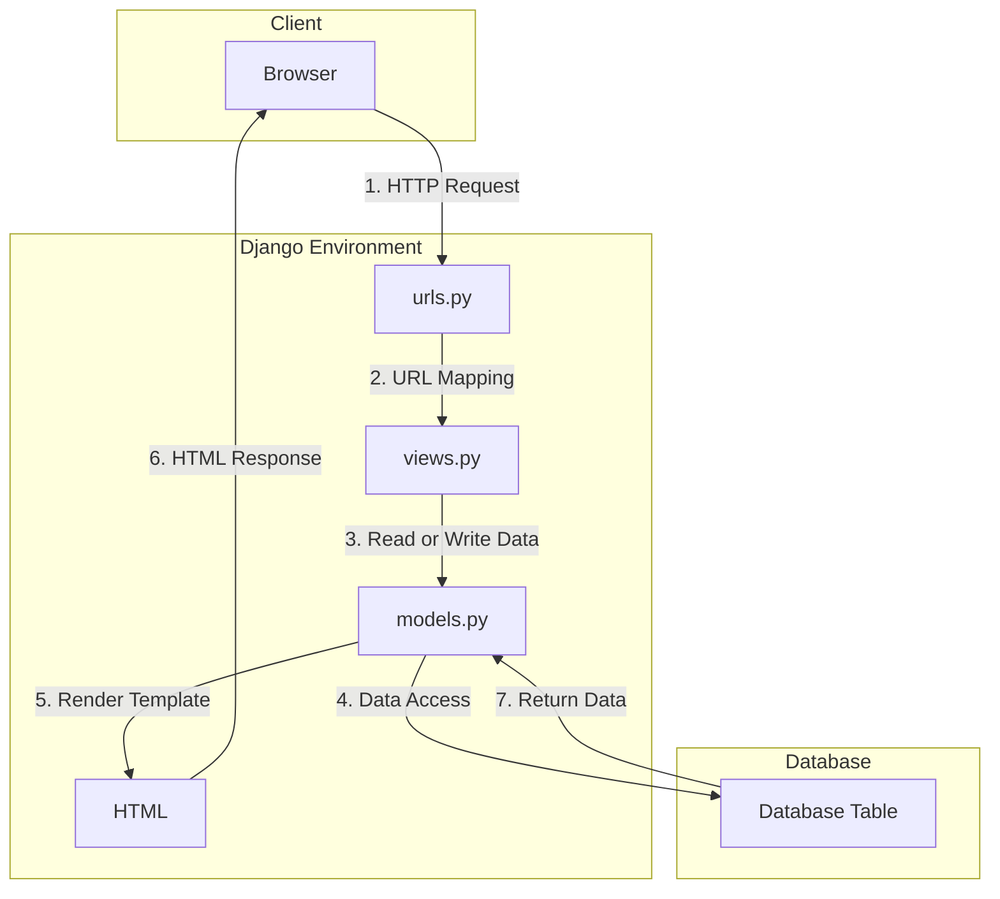

# 📝Inventory List📝
## Assignment 2: Model-View-Template (MVT) Implementation on Django

**Student Details :**

|  `Attribute`  |               `Information`               |
|---------------|-------------------------------------------|
| Name          | Ardhika Satria Narendra                   |
| Student ID    | 2206821866                                |
| Class         | PBP KKI                                   |
| Website URL   | https://inventorylist.adaptable.app/main/ |

---

## Questions and Answers

### -> How do you implement the tasks in the checklist?

1. **Creating a new Django project**

   To start building this application, I initiated a new Django project. Here's how I did it:
   
  - Opened the terminal or command prompt on my system.
  - Navigated to the directory where I wanted to store my Git projects using the command `cd <directory_name>`.
  - Initialized a new repository with the command `git init`. This command created an empty Git repository in my chosen directory.
  - Create and activate the virtual environment by running the following command `python -m venv env` and `env\Scripts\activate.bat`.
  - Created a file named requirements.txt and installed the dependencies with the following command `pip install -r requirements.txt`.
  - Create a Django project using this command `django-admin startproject inventory_list`.
  - Add "*" on `ALLOWED_HOST` in `settings.py`
```
ALLOWED_HOST = ["*"]
```
- Add `.gitignore` file
2. **Creating an app with the name main on that project**

    I needed to create a new app within my Django project. Here's the process I followed:
  - Ran the following command: `python manage.py startapp main`. This command created a new app named "main" within my project.
  - Add `'main'` to the list of existing applications in settings.py.
  - Create folder `templates` inside `main` also `main.html` inside the folder.

3. **Creating a URL routing configuration to access the 'main' app**

   To ensure that I could access the 'main' app, I set up URL routing. Here's how I configured it:
  - Opened the main project's `urls.py` file located in the project's root directory.
  - Imported the `include` function from `django.urls`: `from django.urls import path, include`.
  - Added a new URL pattern to include the 'main' app's URLs. For example:
    ```
    path('main/', include('main.urls')),
    ```
    This mapping directed the `/main/` URL path to the URLs defined in the `main` app's `urls.py`.

4. **Creating a model within the 'main' app**

   I needed to define a model within the 'main' app with specific attributes. Here's how I implemented it:
  - In the `main` app directory, I opened the `models.py` and modified it with the mandatory attributes.
  - In this step, I created a model named `Item` within the 'main' app. The model will define the attributes of items in my inventory management application.

5. **Creating a function in 'views.py' to return an HTML template**
   
  To display information about the application, app name, my name, and my class, I created a view function. Here's how I accomplished it:
  - In the `main` app directory, I opened the `views.py` file.
  - I defined a view function, for example, `show_main`, that took a `request` parameter.
  - Within the view function, I created a `context` dictionary with the necessary data, including app name, my name, and class.
  - I used the `render` function to render an HTML template (e.g., `main.html`) and passed the `context` data to it.

6. **Creating a URL routing to map the function in 'views.py'**

   To ensure that the view function I created is accessible through a URL, I configured URL routing within the 'main' app. Here's how I did it:
   - In the `main` app directory, I created a `urls.py` file.
   - I defined URL patterns within the `urls.py` file, for example:
     ```
     from django.urls import path
     from main.views import show_main

     app_name = 'main'

      urlpatterns = [
         path('', show_main, name='show_main'),
      ]
      ```
      This mapping directed the root URL (e.g., `/main/`) to the `show_main` view function.
     
7. **Deploying the app to Adaptable**
   
   To make the application accessible online, I deployed it to Adaptable or a similar hosting service. Here are the general steps I followed:
   - I ensured that my Django project was under version control with Git.
   - I pushed my project code to the GitHub repository.
   - I used Adaptable or a similar service to deploy my Django application, following my lecture's deployment instructions to make the app accessible online.
  
---
### -> Create a diagram explaining the flow of client requests to a Django web app and its response


Here's a step-by-step explanation of the depicted process:

1. **HTTP Request**: The user makes a request via a web browser.
    - **Component**: Browser
    - **Action**: The browser sends an HTTP request to the Django environment.

2. **URL Mapping**: The request reaches the `urls.py` in the Django environment.
    - **Component**: urls.py
    - **Action**: Django uses the `urls.py` file to map the incoming request to the corresponding view.

3. **Read or Write Data**: The view (`views.py`) may need to read or write data to the database using Django models.
    - **Component**: views.py & models.py
    - **Action**: Depending on the nature of the request (e.g., GET, POST), the view might fetch or update data from the database using models.

4. **Data Access**: The views might also need to access certain HTML templates to generate a response.
    - **Component**: views.py & HTML
    - **Action**: The view fetches the relevant HTML template if needed.

5. **Render Template**: The models help in fetching the necessary data which is then used to populate and render the HTML templates.
    - **Component**: models.py & HTML
    - **Action**: The actual data is filled into the template to create a meaningful HTML page for the user.

6. **HTML Response**: The populated HTML template is then sent back as a response to the browser.
    - **Component**: HTML & Browser
    - **Action**: The rendered HTML page is displayed on the user's browser.

7. **Access**: This is a separate process where models interact with the database tables to perform CRUD operations.
    - **Component**: models.py & Database Table
    - **Action**: Direct interaction with the database to either create, read, update, or delete records.

To sum it up, when a user sends a request from their browser, Django processes it by mapping the request to a view, accessing the necessary data and templates, and then sending back the relevant HTML response. The database plays a central role, storing and providing data when needed.

---

### -> What is the purpose of a virtual environment? Can we create a Django web app without a virtual environment?
A virtual environment is a self-contained directory tree that contains a Python installation for a particular version of Python, along with a number of additional packages. The primary purpose of a virtual environment is to:
1. Isolation: Virtual environments allow Python projects to have isolated dependencies, ensuring that the requirements of each project are in harmony with those of others.
2. Dependency Management: To minimise issues, virtual environments manage different library versions across projects.
3. Version Control: Virtual environments make it easier to work with and test different Python versions.
4. Clean Environment: When starting a new project, you can create a new virtual environment to ensure you're working in a clean environment with only the necessary dependencies installed.

Yes, you can create a Django web app without a virtual environment. However, there are some downsides to this:
1. Potential Dependency Conflicts: Without using a virtual environment, you risk running into issues where Django or one of its dependencies conflicts with another library or application on your system.
2. System Pollution: Installing everything globally can clutter your system's Python environment with unnecessary packages.
3. Versioning Issues: If you're working on two Django projects where one uses Django 2.x and the other uses Django 3.x, you'll face issues if you don't use separate virtual environments.
4. Deployment Challenges: It becomes more challenging to ensure that your production environment matches your development environment in terms of dependencies and versions, which can lead to unexpected behaviours and bugs.

Using virtual environments is a best practice in Python development, especially with web frameworks like Django, because of the challenges and risks mentioned above. While it's not strictly required, it's highly recommended.

---

### -> What is MVC, MVT, and MVVM? Explain the differences between the three.

**MVC (Model-View-Controller):**
- **Model**: Manages the data and business logic.
- **View**: Displays the data (the UI part).
- **Controller**: Handles the user's input and updates the Model and View.

**MVT (Model-View-Template):**
- **Model**: Represents the data structure.
- **View**: Controls what data is displayed and how (more like a controller).
- **Template**: How the data is displayed (akin to the view in MVC).

**MVVM (Model-View-ViewModel):**
- **Model**: Represents the data.
- **View**: Displays the data, purely the UI.
- **ViewModel**: An abstraction of the view, that holds presentational logic.

**Differences:** 
1. **MVC**: A discrete separation in which the controller serves as a connection between the Model and the View.
2. **MVT**: This is primarily used in Django. The "View" works more like a controller, whereas the "Template" is similar to the MVC view.
3. **MVVM**: Suitable for applications with an abundant user interface, such as those built using WPF or Angular. It connects the View and ViewModel, allowing them to communicate with one another.

While all three are architectural patterns aimed at separating concerns, they differ in how they divide jobs and duties.
